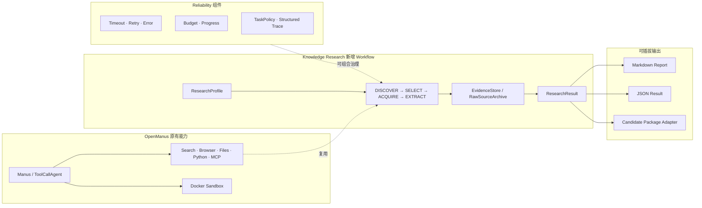

# Reliable OpenManus Agent

> 基于 OpenManus 的公开资料调研、证据构建与可靠任务执行扩展

本项目在保留 OpenManus 原有 ReAct、Tool Calling、Browser、Search、Sandbox 与 MCP 能力的前提下，新增了一条可独立运行的 Knowledge Research Workflow，并围绕任务执行补充了错误分类、重试决策、超时、预算、进度检测、结构化轨迹和任务策略等可靠性组件。首个垂直验证场景是“特种设备使用管理相关公开资料”，但领域知识只存在于配置层，核心代码不绑定该行业。

## 当前状态

- Knowledge Research Live Workflow：`COMPLETE`
- Agent Reliability Enhancement Phase 1A–1D：`COMPLETE`
- 全项目回归：`361 passed`
- 真实调研：7 个搜索候选、3 个入选来源、2 个下载成功、22 条 Evidence
- LLM 证据预算：22 → 6，估算 Evidence Token 35,313 → 9,640
- 真实 LLM：`qwen-max`，5,479 prompt + 495 completion = 5,974 tokens，11,500 ms
- GroundingValidator：8/8 findings 引用了已提供 Evidence
- RAG Candidate Interface v2：`accepted=true`，`ingestion_performed=false`

这些数值来自仓库内保存的真实运行工件；GroundingValidator 只验证引用完整性，不代表已经证明语义蕴含。

## 架构



Knowledge Research 使用独立入口与阶段式编排，没有修改 `BaseAgent`、`ReActAgent`、`ToolCallAgent` 或 `Manus` 的核心循环。Reliability 组件已完成独立测试和 Research Workflow 的观察式集成，但尚未全局接管所有 OpenManus Agent/Tool 调用。

更完整的架构说明见 [project_delivery/02_architecture.md](project_delivery/02_architecture.md)。

## 原项目与二次开发边界

| 能力 | 归属 | 本项目工作 |
|---|---|---|
| BaseAgent / ReAct / Tool Calling / Manus | OpenManus 原有 | 保持核心语义不变 |
| Browser / WebSearch / Files / Python / MCP | OpenManus 原有 | 通过适配器复用，不重新实现 |
| Docker Sandbox / Logger / Memory | OpenManus 原有 | 完成 Windows Docker socket 兼容修复与回归验证 |
| ResearchProfile / Evidence / SourcePolicy | 二次开发 | 通用、配置驱动的数据契约 |
| Research Workflow / ResearchResult | 二次开发 | 固定阶段、离线可测、独立于 RAG |
| Candidate Package Adapter | 二次开发 | RAG 只是可选输出；禁止 APPROVED、Embedding、FAISS 写入 |
| EvidenceBudgetPlanner / GroundingValidator | 二次开发 | 确定性选证与引用集合校验 |
| Reliability Phase 1A–1D | 二次开发 | 组件化可靠性能力；未宣称全局生产级接管 |

## Knowledge Research 调用链

```text
ResearchProfile
  → structured WebSearch results
  → SourcePolicy classification / ranking / selection
  → HTTP or Browser acquisition
  → RawSourceArchive
  → HTML / text-PDF extraction
  → EvidenceStore
  → ResearchSynthesizer
  → ResearchResult
  → Markdown / JSON / Candidate Package adapters
```

首版限制搜索候选不超过 8、最终来源不超过 3，只支持 HTML 与可直接提取文本的 PDF。扫描 PDF 会被标记为 `UNSUPPORTED_SCAN_PDF`，不会触发大型 OCR。

## 快速开始

要求 Python `>=3.12,<3.13`。Docker 仅在运行 Sandbox 测试或相关能力时需要。

```powershell
python -m venv .venv
.venv\Scripts\Activate.ps1
python -m pip install -r requirements.txt
python -m pip install -e .
Copy-Item config/config.example.toml config/config.toml
python -m pip check
```

Linux/macOS 激活命令为 `source .venv/bin/activate`。

查看两个独立入口：

```powershell
python main.py --help
python run_research.py --help
```

运行一次受限规模的在线 Research Workflow：

```powershell
python run_research.py `
  --profile config/research_profiles/special_equipment_validation.toml `
  --policy config/research_policies/default.toml `
  --workspace workspace `
  --max-candidates 8 `
  --max-sources 3
```

该命令可能访问网络；运行前需在本地 `config/config.toml` 配置实际 Search/LLM 能力。不要提交该文件或任何凭据。面试与演示默认推荐复用已有真实工件，避免重复联网和重复模型调用。

## 已保存的真实演示工件

真实运行 ID：`kr_20260828T082105547457Z_b40bc521`

- 运行清单：`workspace/research_runs/kr_20260828T082105547457Z_b40bc521/outputs/run_manifest.json`
- 完整 EvidenceStore：`workspace/research_runs/kr_20260828T082105547457Z_b40bc521/evidence/evidence.json`
- 原始资料：`workspace/research_runs/kr_20260828T082105547457Z_b40bc521/raw_sources/`
- 确定性报告：`workspace/research_runs/kr_20260828T082105547457Z_b40bc521/outputs/research_report.md`
- LLM 报告：`workspace/research_runs/kr_20260828T082105547457Z_b40bc521/outputs/research_report_llm.md`
- 结构化结果：`workspace/research_runs/kr_20260828T082105547457Z_b40bc521/outputs/structured_result.json`
- LLM 指标：`workspace/research_runs/kr_20260828T082105547457Z_b40bc521/outputs/llm_synthesis_metrics.json`
- 证据筛选报告：`workspace/research_runs/kr_20260828T082105547457Z_b40bc521/outputs/evidence_selection_report.json`

详细演示脚本见 [project_delivery/03_demo_guide.md](project_delivery/03_demo_guide.md)。

## 测试

请使用当前虚拟环境解释器运行，避免 Windows 下裸 `pytest` 命中错误 Python：

```powershell
python -m pytest tests/research -q
python -m pytest tests/research_live -q
python -m pytest tests/reliability -q
python -m pytest tests/sandbox -q
python -m pytest tests -q
python -m pip check
```

最终回归基线为 `361 passed`。测试覆盖数量不等同于代码覆盖率，本项目没有宣称特定 coverage 百分比。

## 安全与行为边界

- Agent 只生成 `CANDIDATE`，不能设置 `APPROVED`。
- RAG 联动仅调用 `import_candidate()` 做契约验证；不执行 approve、Embedding、FAISS 或正式 ingestion。
- Search snippet 不能升级为正式 Evidence；Evidence 必须可追溯到已归档原始 HTML/PDF。
- `content_hash` 校验规范化 Evidence 文本，`raw_file_hash` 校验原始文件字节，两者不混用。
- Source tier 是来源优先级，不是事实正确性的证明。
- LLM finding 的 grounding 只保证引用 ID 合法且来自提供集合，不保证语义蕴含。
- Phase 1D TaskPolicy 当前在 Research Workflow 中为 observer，不会悄然改变原 OpenManus 行为。

## 交付文档

- [项目总览](project_delivery/01_project_overview.md)
- [架构说明](project_delivery/02_architecture.md)
- [演示指南](project_delivery/03_demo_guide.md)
- [简历材料](project_delivery/04_resume_material.md)
- [面试问答](project_delivery/05_interview_qa.md)
- [已知限制](project_delivery/06_known_limitations.md)
- [运行手册](project_delivery/07_runbook.md)
- [验证证据](project_delivery/08_validation_evidence.md)
- [最终收尾报告](project_delivery/FINALIZATION_REPORT.md)

## 致谢与许可

本项目基于 [OpenManus](https://github.com/FoundationAgents/OpenManus) 进行二次开发。原项目能力与本项目新增能力已在上文明确拆分。许可证及第三方使用边界以仓库中的 [LICENSE](LICENSE) 为准。
