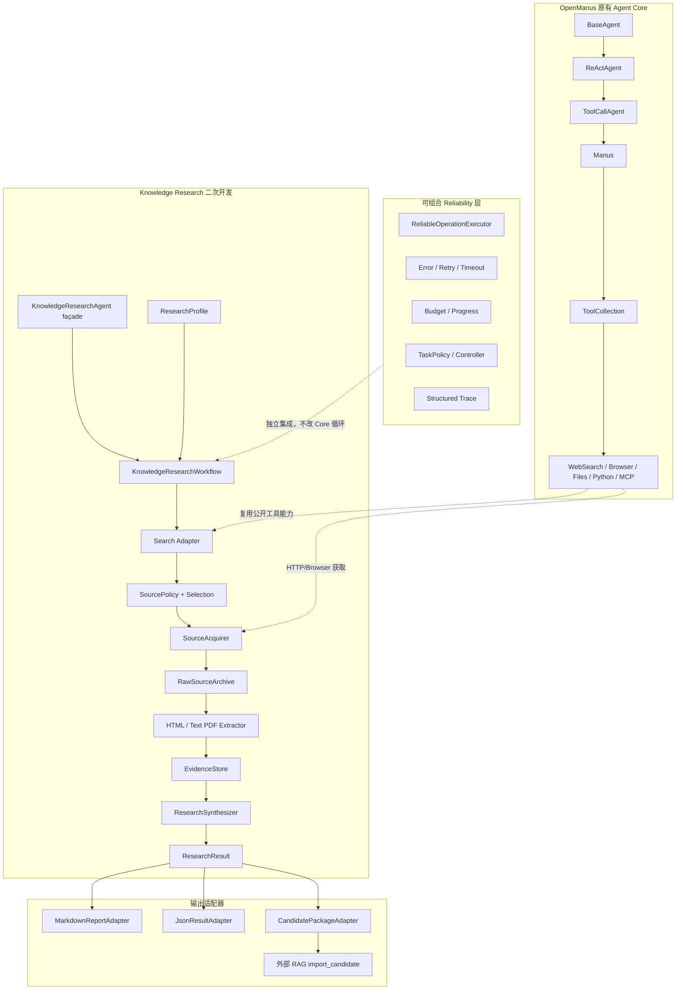
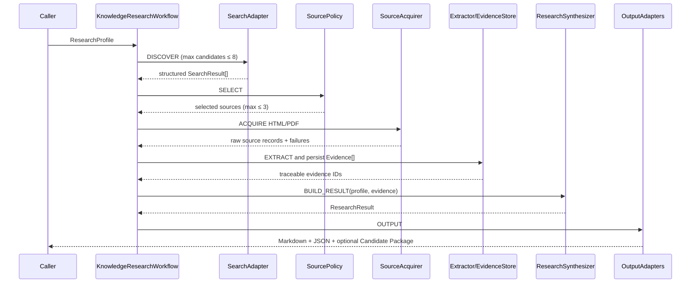
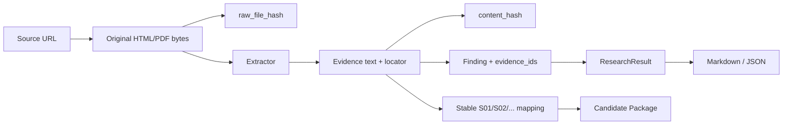
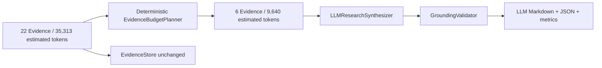
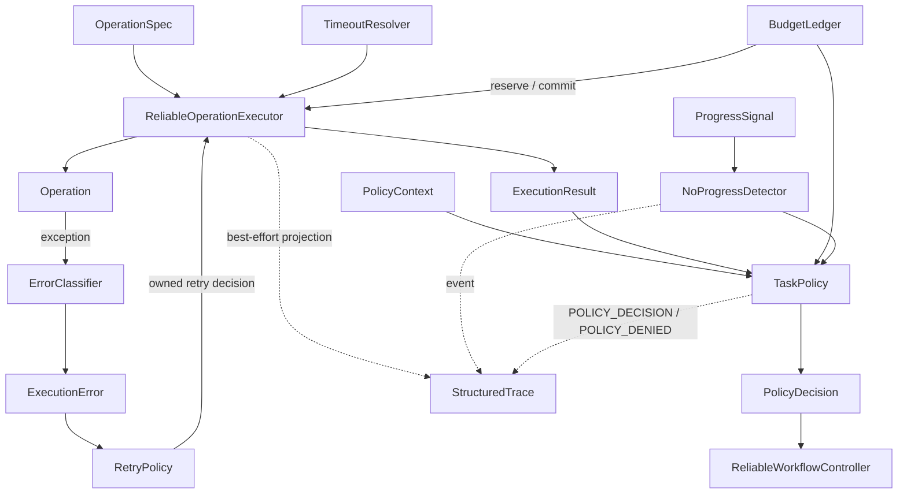
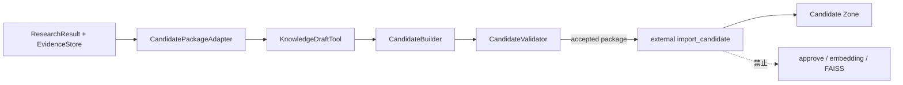

# 架构说明

## 1. 总体结构

`KnowledgeResearchAgent` 没有继承并重写 Manus 的推理循环，而是作为一条独立业务能力的外观对象，组合固定阶段的 `KnowledgeResearchWorkflow`。这样可以复用已有工具，又不会让 LLM 自由决定整个调研阶段结构。

## 2. Research Workflow

### 阶段契约

| 阶段 | 输入 | 输出 | 关键约束 |
|---|---|---|---|
| DISCOVER | ResearchProfile | SearchResult[] | 直接保留 title/url/snippet/engine |
| SELECT | SearchResult[] + SourcePolicy | SelectedSource[] | Tier 是优先级，不是真实性证明 |
| ACQUIRE | SelectedSource[] | RawSource records | 下载失败可部分完成；snippet 不是 raw source |
| EXTRACT | HTML/PDF | Evidence[] | 只支持 HTML 与文本 PDF；保留定位与双 hash |
| BUILD_RESULT | Profile + Evidence | ResearchResult | finding 必须关联 Evidence；不足写 limitations |
| OUTPUT | ResearchResult + EvidenceStore | 多种输出 | RAG 是可选 adapter，不污染 ResearchResult |

## 3. 数据与追溯链

- `raw_file_hash = SHA256(original file bytes)`，证明归档文件的字节身份；
- `content_hash = SHA256(normalized evidence content)`，证明 Evidence 文本身份；
- 两者被独立保存和校验，不要求相等；
- Evidence ID 基于 canonical source identity、页码/section 和 content hash 稳定生成；
- Sxx 在 Evidence 输入顺序变化后仍稳定；
- Candidate `status` 固定为 `CANDIDATE`，调用方无法传入 `APPROVED`。

## 4. Evidence Budget 与 LLM

完整 EvidenceStore 永久保留；EvidenceBudgetPlanner 只生成一次 LLM 调用的选中子集。

Planner 依据 topic/questions 关键词重叠、SourcePolicy level、preferred source types、来源多样性、文本去重、同来源占比、长度和 token budget 排序。相同 Profile、Evidence 集合和预算得到相同选中 ID，输入顺序不会改变结果。Token 选择是估算值，真实 API usage 另行记录。

GroundingValidator 验证 finding 至少引用一个存在且属于 SelectedEvidence 的 ID，并拒绝未知或已排除 ID；它不能证明 statement 在语义上被 Evidence 充分蕴含。

## 5. Reliability 的真实关系

Reliability 不是一条把所有组件强行串联的流水线。执行控制、进度观察和任务策略具有不同权威边界：

关键语义：

- `BudgetLedger` 是预算权威状态，Trace 只是投影，不能反向恢复余额；
- `RetryPolicy` 决定是否重试，Executor 负责执行与预算结算；
- `NoProgressDetector` 消费 Workflow progress signals，不在每个 Operation 的线性调用链中；
- `TaskPolicy` 消费上下文、结果、预算与进度状态，产生 `CONTINUE/STOP/FALLBACK/REPLAN`；
- Research Workflow 当前以 observer 方式记录 PolicyDecision，没有在所有阶段强制执行 STOP；
- 原 OpenManus LLM 层已有 Tenacity 等重试，本 Reliability 层解决的是可解释的操作级重试所有权、预算与结果契约，不将原能力冒充为新增成果。

## 6. 与 RAG 的边界

Agent 与 RAG 通过 Candidate Interface v2 解耦。Agent 负责发现、归档、Evidence、ResearchResult 和候选包；RAG 负责结构与元数据校验、引用和 raw path 校验、重复 document ID 检查及 Candidate Zone 保存。真实联动结果为 `accepted=true`、`ingestion_performed=false`。

## 7. 修改边界

未修改以下核心语义：

- `BaseAgent.run()/step()`；
- `ReActAgent.think()/act()`；
- `ToolCallAgent.execute_tool()`；
- Manus 默认工具与主入口行为；
- PlanningFlow；
- RAG 正式知识库、Embedding 或 FAISS。

Sandbox 基础设施曾做过一个独立兼容补丁：Docker session 改为依赖 socket-like 的公开行为，而不是 Windows `NpipeSocket` 不存在的 `_sock` 私有属性；同时将过期的 Python 3.10 测试契约更新为与项目 `>=3.12` 和 sandbox 镜像一致的 3.12。该补丁不改变 Agent 业务语义或容器安全隔离。

## 8. 扩展点

- 新行业：增加 ResearchProfile/SourcePolicy 配置；
- 新来源格式：实现 extractor port，不修改 EvidenceStore；
- 新生成模型：实现 `ResearchSynthesizer`，不修改 Downloader/Builder；
- 新输出：实现 `OutputAdapter`，不修改 ResearchResult；
- Reliability 全局化：未来通过统一 operation boundary 集成，而不是改写 ReAct 语义；
- 语义 grounding：未来可增加独立 entailment verifier，但必须与当前 ID-level validator 分开命名和报告。
