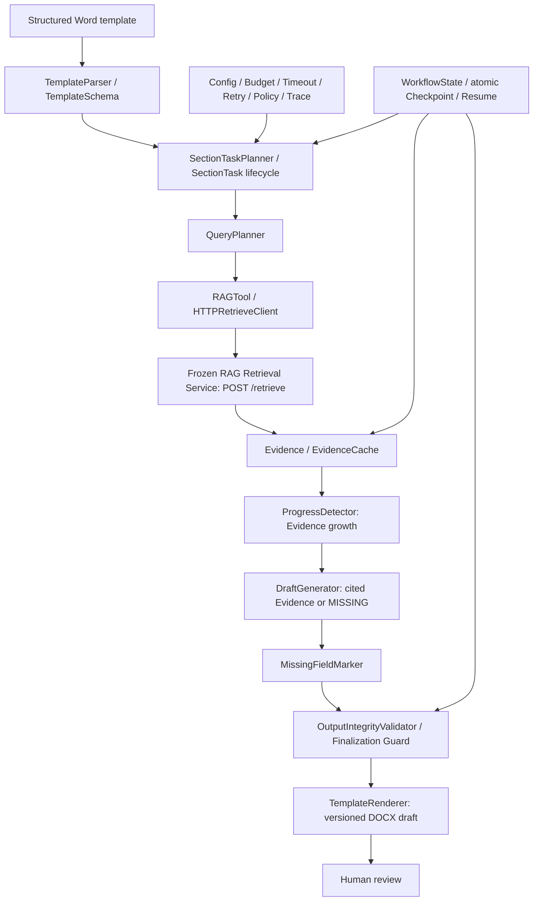

# Final architecture

The fixed high-level workflow owns section order and finalization. Local decisions are limited to bounded field queries, Evidence growth, and stop conditions. The Agent never opens FAISS; the frozen RAG service owns retrieval. Its final policy is DENSE_ONLY with SECTION_PATH representation. The old Knowledge Research workflow and its browser/source acquisition code remain separate and are denied by the Document Workflow task policy.

DraftGenerator and MissingFieldMarker are stages implemented in `workflow.py` rather than separate classes; the diagram names their responsibilities without introducing a second architecture.

The reliability layer spans the same chain: central config validates limits and paths before execution; BudgetLedger bounds steps and calls; the HTTP adapter owns finite retry and timeout; ProgressDetector stops stagnant collection; policy blocks browser/search/FAISS access; Trace records hashes, IDs, status and error type; checkpoint preserves the Evidence body needed for recovery; and output validation blocks fabricated or orphan Evidence IDs. `requires_human_review` is mandatory.
