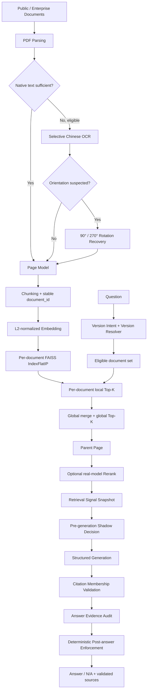
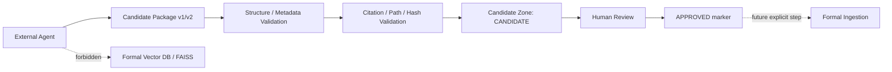

# Final Architecture

## 1. 架构定位

《企业文档可信知识库与问答系统》是基于原竞赛 RAG 的工程化二次开发。核心架构保持行业
通用；特种设备公开资料仅是首个验证语料，不是业务逻辑分支，也不代表真实生产部署。

## 2. 在线问答主链路



真实代码中的 Version Resolver 在检索前先确定 eligible document set，再由 Retriever 应用
版本策略；图中没有把版本治理描述成生成后的补丁。

## 3. 数据与索引边界

### 文档身份

Generic `DocumentMetadata` 至少传播：`document_id`、title、document type、source、source URL、
category 和 tags。`document_id` 使用稳定、唯一、可重复生成的标识，不以可能重复的 title
单独作为身份。Legacy `company_name` 仅作为兼容字段。

### Page / Chunk / Citation

```text
Document(document_id)
  ├─ Page(document_id, page_number)
  └─ Chunk(document_id, page_number, chunk_id)
```

Parent Page 去重和 Generic Citation 都使用复合身份 `(document_id, page_number)`，避免不同
文档同页码相互覆盖。Citation Validator 不会自动补页。

### FAISS

系统保留每文档独立的 `IndexFlatIP`，没有合并成一个巨型索引。文档和查询向量都进行 L2
归一化，因此 inner product 可解释为 cosine similarity。Generic Retrieval 使用“每文档局部
Top-K → 全局 merge → 全局 Top-K”，避免把所有 chunk 全量汇总。

## 4. OCR 是选择性适配层

OCR 默认不是全局开启。只有 Native Text 不足且满足配置条件的页面才进入 EasyOCR；结果按
文件、页码和配置 hash 缓存。OCR Quality Gate fail closed，避免把空页或明显损坏文本进入
正式 Corpus。横置第 37 页只在显式 orientation-suspected 条件下比较 90°/270°，没有重跑
其他 53 页，也没有把行业字段写进 production orientation selector。

## 5. Version Governance

```text
Question
  → temporal/version intent
  → version family resolution
  → ACTIVE/SUPERSEDED eligibility
  → current or historical corpus location
  → retrieval
  → version_trace
```

默认查询使用当前有效版本；明确询问旧版时可加载独立历史检索资产。旧数据不被删除。当前
实现只覆盖有明确 manifest 和索引资产的版本关系，不做自动法律解释或 Conflict Resolver。

## 6. Trusted QA 边界

Trusted QA 严格拆成两个阶段：

```text
Pre-generation
  RetrievalSignalSnapshot
  → EvidenceSufficiencyDecision (SHADOW ONLY)

Post-generation
  Structured Output
  → Citation Membership
  → AnswerEvidenceAudit
  → trusted_qa_post_answer_v1
  → PASS | VALID_ABSTENTION | FAIL_CLOSED
```

`ENFORCE` 的唯一 scope 是 `POST_ANSWER_ONLY`。Cosine、margin、document/page diversity 和
retrieval agreement 仍是 Shadow 信号，不会提前跳过生成。正式 fail-closed 只覆盖：结构
无效、实质答案无引用、引用成员关系失败、valid/invalid 引用混合、N/A 与非空引用矛盾。
失败后对外返回 `N/A + empty citations`，内部 trace 保留原始结果和原因。Gate 不增加 LLM
调用。

Citation Membership 只证明来源属于当前 Retriever evidence set，不证明 semantic entailment
或 factual correctness。

## 7. Candidate / Agent 旁路



Agent 不能调用 Embedding、写 FAISS 或发布正式 Knowledge Base。`import_candidate()` 只验证和
存储 Candidate；`approve_candidate()` 只改变审核状态，仍返回 `ingestion_performed=false`。
v2 的 `raw_file_hash` 从真实文件字节重算，`content_hash` 仅做声明格式校验，不伪称内容重算。

## 8. Legacy Compatibility

- 默认 routing mode 仍为 `legacy_company`。
- Generic Mode 不依赖 `company_name`。
- Legacy competition submission 的字段和 1-based → 0-based Citation 后处理保持兼容。
- Candidate v1 wrapper 继续兼容，v2 使用严格 Root List 与 hash-aware schema。
- Trusted QA metadata 只进入内部 trace，不强迫旧消费者接收新字段。

## 9. 模块对应

| 能力 | 主要模块 |
| --- | --- |
| Parsing / chunking / ingestion | `src/pdf_parsing.py`, `src/text_splitter.py`, `src/ingestion.py` |
| Metadata | `src/document_metadata.py` |
| Retrieval / Parent Page / Rerank | `src/retrieval.py`, `src/reranking.py` |
| Structured Generation / Prompt | `src/api_requests.py`, `src/prompts.py` |
| Candidate v2 | `src/candidate_knowledge.py` |
| Selective OCR / rotation | `src/ocr_processing.py`, `src/ocr_rotation.py` |
| Version Governance | `src/versioning/` |
| Trusted QA | `src/trusted_qa/` |
| Pipeline integration | `src/questions_processing.py`, `src/pipeline.py`, `main.py` |
| Evaluation | `src/evaluation/`, `data/evaluation/`, `reports/` |

## 10. 不在当前架构中的能力

当前没有生产级认证授权、租户隔离、异步任务队列、分布式索引、在线监控平台、自动 Conflict
Resolver、semantic entailment verifier、learned confidence 或通用 hallucination detector。
这些是明确边界，不应在简历或面试中声称已经实现。
