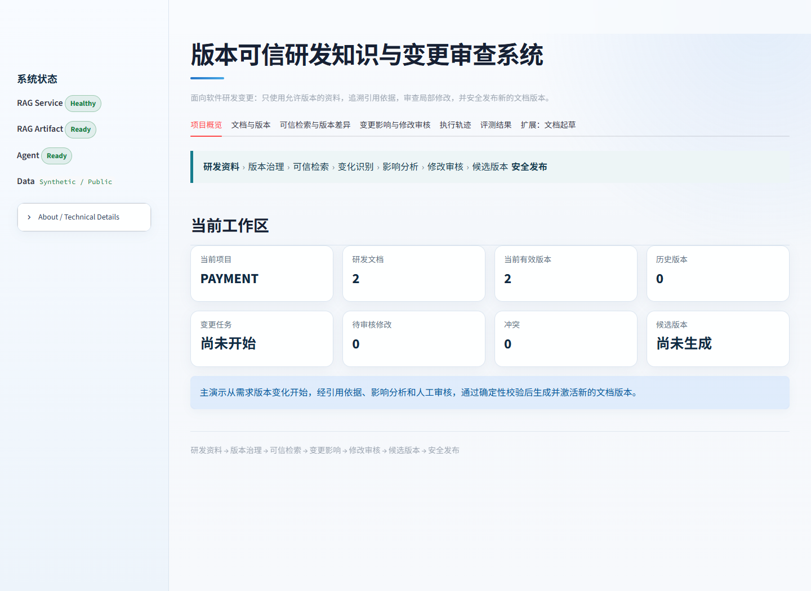

# 版本可信研发知识与变更审查系统

## 1. 项目一句话介绍

面向软件研发变更的版本可信 RAG 与人工审查 Agent：默认只检索当前有效资料，保留历史版本显式查询和引用溯源，并把需求变化转化为可审核、可冲突检查、可幂等应用的局部文档修改。

## 2. 为什么存在这个项目

研发需求、设计、接口和测试文档会持续迭代。普通 RAG 容易把新旧版本一起召回；普通生成式 Agent 又可能在缺少引用、未经审核或目标内容已经变化时直接写入。本项目把版本治理、Evidence、局部修改、人工审核、候选版本校验和安全发布放在一条可验证的业务链中。

## 3. 核心业务场景

主 Demo 使用完全合成的 Case A（PAYMENT 并发容量与接口形态变化）完成三分钟演示。Case B 使用独立的审计日志留存周期变化，只作为跨案例复用证明。

- Case A：最大并发从 500 调整为 1000，并涉及吞吐量和同步 → 异步变化。
- Case B：审计日志留存周期从 7 天调整为 30 天，使用不同 Requirement、章节、Evidence、Patch 和资产组合。
- 系统先区分当前有效版本与历史版本，再识别受影响的设计、接口和测试资产。
- 已确认关系与语义检索得到的疑似影响分开展示。
- Agent 只生成目标段落的修改建议，经人工审核和确定性门禁后生成候选版本。
- 候选版本通过结构、索引和业务校验后才激活；失败时旧有效版本保持不变。

两套案例都只使用合成资料。跨案例通过只说明同一核心流程在两套结构不同的固定合成案例上复用，不代表适用于所有企业场景。

## 4. Public Demo

- Live Demo：<后续部署完成后填写>
- RAG API Docs：<后续部署完成后填写>
- Video Demo：<以后填写>

Public Demo uses synthetic engineering documents。Session 操作是临时的，免费后端可能在首次访问时冷启动。它是可部署、可验证的软件工程 AI 原型，不代表 Production Deployment。

部署步骤见 [免费公网部署指南](project_delivery/public_value_prototype/free_deployment_guide.md)。

## 5. Why This Is More Than a Scripted Demo

- 两套独立合成变更案例使用不同变化类型、Requirement、Evidence、Patch 和资产组合。
- 核心 Domain、Retriever 与 Agent 没有 Case-specific business branching。
- 默认检索当前有效版本，历史版本必须显式查询，Evidence 保留版本和章节来源。
- Patch 必须经过 Human Review、Conflict Detection、Idempotency 和 Candidate Validation。
- 两套案例由相同 HTTP 工作流自动评测，并分别报告结果。
- Public profile 提供远程 RAG URL、只读 Baseline、Session 隔离、冷启动处理和 LLM 调用预算。

证据见 [硬编码审计](project_delivery/public_value_prototype/hardcode_audit.md) 与 [跨案例评测](project_delivery/public_value_prototype/cross_case_evaluation_report.md)。

## 6. 系统架构图

    Streamlit 产品界面
       │
       ├── 文档与版本 / 可信检索 / 版本差异
       │
       └── 变更影响 / 修改审核 / 执行轨迹 / 固定评测
                         │
    Engineering Documents
                         │
                         ▼
    Structure Processing + Version Governance
                         │
                         ▼
    Version-aware RAG
    Scope │ DENSE_ONLY │ SECTION_PATH │ Evidence │ Diff
                         │ HTTP
                         ▼
    Change Review Agent
    Impact │ Evidence Selection │ Local Patch │ Quality Gate
    Human Review │ Conflict Detection │ Idempotency │ Resume
                         │
                         ▼
    Candidate Version → Validation → Safe Activation

当前正式实现没有使用 LangGraph、Hybrid、GraphRAG、数据库、Redis、消息队列或多 Agent。

## 7. RAG 与 Agent 职责边界

| 模块 | 负责 | 不负责 |
|---|---|---|
| Version-aware RAG | 文档结构处理、版本治理、Scope 检索、Evidence、Citation、Version Diff、候选版本构建与激活 | 审核决策、自动修改代码、证明答案一定正确 |
| Change Review Agent | 变化识别、已确认/疑似影响分层、Evidence Selection、局部修改、人工审核、Quality Gate、冲突与幂等、Checkpoint/Resume | 重新实现 Retriever、绕过版本边界、未经批准写入 |
| Streamlit UI | 用业务语言展示真实状态、Trace 和固定评测 | 为展示而重复调用 RAG 或模型 |

## 8. 主 Demo 流程

1. 查看需求 V1 与 V2。
2. 默认查询只返回当前版本的 1000 并发。
3. 显式选择历史版本后可查询旧的 500 并发。
4. Version Diff 展示 500 → 1000、吞吐量和同步 → 异步变化。
5. 影响分析区分已确认关系与疑似影响。
6. 查看文档、版本、章节、页码完整的引用依据。
7. 对比目标段落原文与修改建议。
8. 人工批准、编辑后复核或拒绝。
9. Quality Gate 检查 Evidence、Scope、Freshness、基础版本、目标段落、重复应用和审核状态。
10. 生成候选版本，通过校验后安全发布。
11. 执行轨迹展示真实调用数、Evidence 数量、耗时和阻断原因。
12. 评测页展示固定 7 条结果与离线版本治理对照。

完整讲解见 [三分钟 Demo](project_delivery/prototype_final/prototype_final_demo_script.md)。

## 9. 核心工程设计

- 版本治理：同一文档只有一个当前有效版本，历史版本仅在显式 Scope 中可查询。
- Evidence Context Budget：候选先经过 Scope、版本、Freshness 和去重，再按 max_evidence_count 入选；关键 Evidence 超出预算时失败关闭，不静默丢弃。
- Deterministic Quality Gate：复用已有状态，统一输出 PASS 或 BLOCKED 及原因码，不增加 LLM Judge。
- 局部 Patch：只替换已经绑定 Anchor 与原文哈希的目标段落，不重写全文。
- Conflict Detection：基础版本、Anchor、原文或哈希变化都会阻止覆盖。
- Idempotency：Patch、基础版本、Anchor 和原文哈希共同形成幂等键。
- Candidate Version：写入候选文件并完成校验后才激活，原 DOCX 不被覆盖。
- Checkpoint/Resume：恢复时复用成功状态和已应用幂等键，避免重复副作用。
- HTTP 边界：Agent 通过现有 RAG API 工作，不导入 RAG 内部索引实现。

## 10. Evaluation

最新固定合成评测：

| 指标 | 结果 |
|---|---:|
| Evaluation Case Count | 7 |
| Hit@5 / Recall@5 / MRR | 1.0 / 1.0 / 1.0 |
| 当前版本正确性 | PASS |
| Citation membership | PASS |
| No-answer / Scope 拦截 | PASS |
| Retrieval P50 | 64.330 ms |
| Retrieval P95 | 68.384 ms |
| Impact Precision / Recall | 1.0 / 1.0 |
| 未批准写入 | 0 |
| 重复 Patch 应用 | 0 |
| Candidate Status | ACTIVE |

离线对照真实返回了 requirements-v1 与 requirements-v2；相同问题在正式 Version-aware Retrieval 中只返回 requirements-v2。该对照只存在于 Evaluation，不进入生产检索路径。结果文件位于 [evaluation_results.json](project_delivery/v4_change_impact_review/evaluation_results.json)。


### Cross-case Evaluation

| 检查 | Case A | Case B |
| --- | --- | --- |
| Change → Impact → Evidence → Patch → Review | PASS | PASS |
| Conflict / Idempotency | PASS | PASS |
| Candidate / Safe Activation / New Retrieval | PASS | PASS |
| Baseline Immutable | PASS | PASS |

Case A 与 Case B 结果分开记录在 [跨案例评测报告](project_delivery/public_value_prototype/cross_case_evaluation_report.md)。这不是“系统准确率 100%”。


## 11. Screenshots



界面主导航为：项目概览、文档与版本、可信检索与版本差异、变更影响与修改审核、执行轨迹、评测结果。旧文档起草流程保留在最后的扩展入口。

## 12. Quick Start

Windows PowerShell 一键启动：

```powershell
cd <仓库目录>
.\start_prototype.ps1
```

打开 http://127.0.0.1:8502 。脚本复用当前 Python 环境，把本次合成运行数据写入系统临时目录，不读取真实企业文档。

手动启动和环境说明见 [demo-ui/README.md](demo-ui/README.md)。RAG API 文档位于 http://127.0.0.1:8765/docs 。

## 13. Test / Validation

三个测试入口：

```powershell
cd RAG-Challenge-2-main
.\.venv\Scripts\python.exe -m pytest -q
```

```powershell
cd ..\OpenManus-rag
.\.venv\Scripts\python.exe -m pytest -q
```

```powershell
cd ..\demo-ui
..\OpenManus-rag\.venv\Scripts\python.exe -m pytest -p no:cacheprovider tests -q
```

固定评测：

```powershell
cd demo-ui
..\OpenManus-rag\.venv\Scripts\python.exe scripts\run_v4_evaluation.py
```

最终回归同时覆盖 Safe Business、Human Review、Checkpoint/Resume、Evidence Freshness、Conflict、Idempotency、Candidate Version、Safe Activation、Agent ↔ RAG HTTP、Versioned E2E、Offline Runtime、Streamlit、compile/import、pip check、Secret Scan 和 git diff --check。完整结果见 [回归报告](project_delivery/prototype_final/prototype_final_regression_report.md)。

## 14. Design Decisions

- 保留 DENSE_ONLY + SECTION_PATH，因为现有评测已经满足业务目标，本轮没有证据支持引入 Hybrid、BM25、RRF 或 Reranker。
- 不迁移 LangGraph，因为当前工作流状态机、Checkpoint 和副作用边界已清楚可测；迁移会增加风险而不增加本轮业务价值。
- 不做全文生成。局部修改更容易审核、冲突检查、幂等重放和保留原格式。
- Suggested Impact 始终是审核建议，不升级为确定事实。
- Token/Cost 本轮不展示。当前主链 llm_calls 为 0，且没有可靠 Usage 与可维护价格配置。
- UI 只读取真实状态和固定评测 JSON，不为展示重复调用 RAG 或模型。

## 15. Known Limitations

1. Scope 是业务检索范围，不等于 ACL/RBAC。
2. Evidence/Citation 提供可追溯性，不自动证明答案事实正确。
3. Suggested Impact 不等于 Confirmed Trace。
4. Human Review 当前是单审核人 MVP。
5. Demo 主要使用合成研发资料。
6. 主要 Engineering Asset 为 DOCX。
7. Patch 只覆盖正式支持的有限段落替换操作。
8. Vector Backend 继续使用 FAISS。
9. 当前不实现多租户。
10. 当前不实现自动代码修改。
11. 当前不替代完整 ALM / SDLC 工具。

## 16. Roadmap

后续如果有真实需求，可以在保持 HTTP 边界、Evidence、Quality Gate 和候选版本机制的前提下扩展 Git Diff 作为新的 Engineering Asset Adapter。它不会改变当前版本可信 RAG 与人工审查主链。本轮 Prototype Final 不实施该能力。

## Repository Layout

- [RAG-Challenge-2-main](RAG-Challenge-2-main/)：版本可信研发知识服务。
- [OpenManus-rag](OpenManus-rag/)：Evidence-driven 变更审查 Agent。
- [demo-ui](demo-ui/)：统一 Streamlit 产品入口。
- [project_delivery/prototype_final](project_delivery/prototype_final/)：差距分析、架构、Demo、评测、回归和面试材料。
- [project_delivery/public_value_prototype](project_delivery/public_value_prototype/)：跨案例价值验证、公开部署准备、安全与最终报告。

仓库不包含个人 API Key、真实企业研发资料或用户本地运行输出。两个子项目保留原始许可证与著作权声明。
