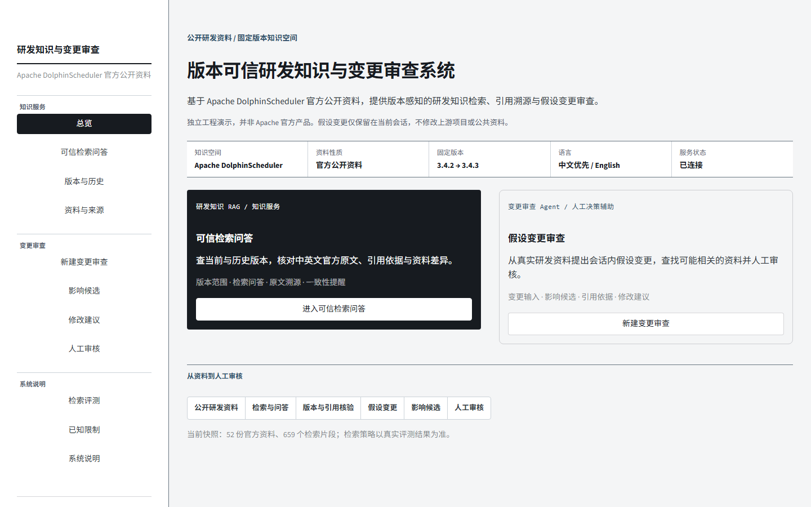

# 版本可信研发知识与变更审查系统

基于 **Apache DolphinScheduler 官方公开资料**的双语研发知识 RAG 与会话内假设变更审查工作台。本项目是独立的工程演示，**不是 Apache 官方产品，也不代表上游项目的内部系统**。

- [在线工作台](https://enterprise-rag-agent-suite-bfmkgsimdisxcewgco7ydk.streamlit.app/)
- [RAG API 文档](https://version-aware-rag-public-demo.onrender.com/docs)
- [RAG 健康状态](https://version-aware-rag-public-demo.onrender.com/health)

> 链接指向现有公网服务。**本轮本地修改尚未提交或部署**；公开页面在重新部署前仍可能显示旧版合成案例。请以平台部署提交和页面内容判断是否已更新。



## 可以做什么

| 研发知识 RAG | 变更审查 Agent |
| --- | --- |
| 查询固定版本的中英文官方资料，查看当前或历史版本、章节和官方原文链接。 | 选择真实官方文档或 DSIP 片段，输入假设性修改，查看影响建议、引用依据和会话草案，最后人工审核。 |
| 生成式回答仅在模型密钥由部署平台安全配置后启用；引用必须来自本次真实检索。 | 假设性修改只保留在当前会话，不写入 Apache 上游或公共知识库，也不假装发布候选版本。 |

公开资料采用固定发布标签 **3.4.2**（基线）和 **3.4.3**（当前），包含 52 份官方文档、Release、DSIP Issue 与明确关联的 PR，切为 659 个片段。中文和英文属于**同一个知识空间**；默认中文优先，也可选全部、仅中文或 English。当前版本默认参与检索，历史版本需要显式选择。

## 检索策略为何选 BM25

在同一真实语料、46 条逐条核验的问题和 Top-5 条件下，已实际运行 Dense、BM25 与 Hybrid。当前轻量 Dense 是 512 维字符 n-gram 哈希向量，**并非神经语义模型**。BM25 的 Hit@1 **0.3953**、Hit@5 **0.7907**、MRR **0.5558**，优于 Dense（0.2093 / 0.4186 / 0.2934）和 Hybrid（0.3023 / 0.6047 / 0.4322），因此被选为**公开资料默认检索策略**。分组样本不足以支持稳定的条件路由；未取得可在免费部署约束下重复运行的双语 Reranker，故未评测也未启用。详见 [真实语料策略报告](evaluation/real_world_retrieval/retrieval_policy_report.md)及[逐条结果](evaluation/real_world_retrieval/results/benchmark_results.json)。这不是全量 DolphinScheduler 资料的准确率结论。

无答案问题的检索仍会返回候选，所以**候选结果不等于答案**。未配置在线模型、回答弃答或引用校验失败时，界面只展示待核对的原文，不伪造回答。资料一致性提醒只报告可直接验证的版本文字差异或同名参数的不同明确值，不推断语义矛盾概率。

## 架构与数据边界

```text
Apache DolphinScheduler 3.4.2 / 3.4.3 官方资料、Release、DSIP
  └─ 固定快照 + 来源/版本/语言/许可证元数据 + 轻量索引
      └─ FastAPI /public/*：BM25 检索 → 可选在线生成 → 引用校验
          ├─ Streamlit：研发知识 RAG
          └─ Streamlit：变更审查 Agent
                 已验证的显式关系 / 检索建议分开显示
                 Diff → 影响分析 → 官方依据 → 会话草案 → 人工审核
```

原有版本治理 RAG、Document Workflow Agent、合成 Case A/B 与其回归测试仍保留。合成案例是**自动化夹具**，不再作为公开工作台默认数据；需要复现历史夹具界面时显式设置 `DEMO_LEGACY_FIXTURES=true`。其旧版候选版本、安全发布与跨案例评测只证明合成测试流程，**不宣称已对 Apache 上游项目发布**。

## 三分钟体验

1. 打开“可信检索问答”，询问“DolphinScheduler 参数优先级从高到低是什么？”；查看回答及固定版本官方原文链接。也可选择 English 或 3.4.2 历史版本。
2. 打开“新建变更审查”，选择一份 3.4.3 官方资料与其中一段，输入**假设性**修改。
3. 检查“可能受影响”的资料、已确认/建议关系、原文和会话草案，再完成人工审核。公共知识库和上游仓库均不改变。

## Quick Start（Windows PowerShell）

使用 Python 3.12；克隆后无需任何私有企业资料或本地历史 runtime：

```powershell
py -3.12 -m venv RAG-Challenge-2-main\.venv
& .\RAG-Challenge-2-main\.venv\Scripts\python.exe -m pip install -r RAG-Challenge-2-main\requirements-render.txt
py -3.12 -m venv OpenManus-rag\.venv
& .\OpenManus-rag\.venv\Scripts\python.exe -m pip install -r OpenManus-rag\requirements.txt
& .\OpenManus-rag\.venv\Scripts\python.exe -m pip install -r demo-ui\requirements.txt
.\start_prototype.ps1
```

打开 <http://127.0.0.1:8502/>；API 文档位于 <http://127.0.0.1:8765/docs>。无密钥也可做官方资料检索和沙箱变更审查。若需要生成式回答，在**本机环境或 Render 环境变量**设置 `DASHSCOPE_API_KEY`，并以 `-EnableGeneration` 启动本地脚本，或在 Render 设置 `RD_V2_ALLOW_EXTERNAL_GENERATION=true`。不要提交实际密钥。详细手动启动和云端字段见 [UI README](demo-ui/README.md) 与 [部署指南](project_delivery/public_value_prototype/free_deployment_guide.md)。

## Data Source & Attribution

语料仅来自 [apache/dolphinscheduler](https://github.com/apache/dolphinscheduler) 的官方固定标签文档、[3.4.2 / 3.4.3 Releases](https://github.com/apache/dolphinscheduler/releases)、[DSIP-107 提案](https://github.com/apache/dolphinscheduler/issues/18454)和[明确引用它的实现 PR](https://github.com/apache/dolphinscheduler/pull/18464)。每份资料的来源 URL、仓库、tag 对应 commit、路径、语言、类型、检索时间与 SHA-256 见 [corpus_manifest.json](RAG-Challenge-2-main/public_corpus/corpus_manifest.json)。源项目的 [Apache License](RAG-Challenge-2-main/public_corpus/LICENSE) 与 [NOTICE](RAG-Challenge-2-main/public_corpus/NOTICE) 随快照保留。英文原文不经自动翻译充作中文证据。

## 验证与限制

运行 RAG、Agent、UI 测试的方法见 [部署指南](project_delivery/public_value_prototype/free_deployment_guide.md)；真实检索问题与证据标注在 [evaluation/real_world_retrieval](evaluation/real_world_retrieval/)。该子集不能覆盖所有 DolphinScheduler 功能；检索分数不代表事实真实性，语义相关不等于真实追踪关系，人工审核也不等于修改上游项目。公开版本没有登录、RBAC、多租户、源码自动修改或 GitHub PR 写入。
