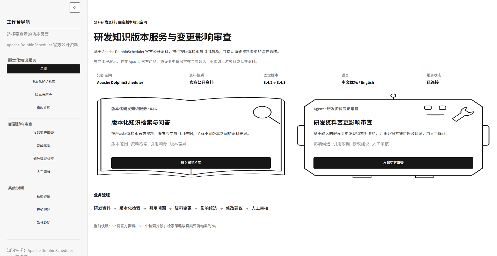

# 研发知识版本服务与变更影响审查系统

基于 Apache DolphinScheduler 官方公开资料构建的版本化研发知识服务与变更影响审查系统。RAG 按版本检索资料并提供可追溯依据；Agent 调用检索结果整理影响候选和修改建议，由人审核。本项目是独立工程演示，不是 Apache 官方产品，也不代表上游内部系统。

- [GitHub 源码仓库](https://github.com/Wdp-SE/enterprise-rag-agent-suite)
- [在线工作台](https://enterprise-rag-agent-suite-bfmkgsimdisxcewgco7ydk.streamlit.app/)
- [RAG API 文档](https://version-aware-rag-public-demo.onrender.com/docs)
- [RAG 健康状态](https://version-aware-rag-public-demo.onrender.com/health)
- [最终检索选型报告](evaluation/real_world_retrieval/final_selection/final_selection.md)

> 在线链接指向已有公网服务，实际运行版本以托管平台显示的部署提交为准。



## 项目与架构

研发人员可以在固定版本的 DolphinScheduler 资料中提问，查看命中的章节、原文和来源；也可以选取资料片段提出假设性变更。RAG 提供带来源的检索证据，Agent 根据证据组织影响候选、修改建议和会话草案，交由用户人工审核。Agent 的草案保存在当前 Session 沙箱中，不修改公共语料或 Apache 上游。

    Apache DolphinScheduler 官方资料快照
      → 固定版本、来源、语言和章节元数据
      → FastAPI：BM25 检索、候选证据及可选的带引用生成
      → Streamlit：研发知识服务与变更审查 Agent
      → 人工核对与审核

在线工作台用于体验产品流程；API 文档用于查看公开 RAG 接口。公开语料是 Apache DolphinScheduler 3.4.2 与 3.4.3 的有限快照，共 52 份来源。启动时不抓取上游，不重建 OCR、Embedding 或 FAISS 索引。

### 目录职责

- `versioned-rag-service/`：FastAPI 知识服务，负责版本范围内的 BM25 检索、引用依据和可选的引用约束回答。
- `change-review-agent/`：变更审查 Agent 与可复用的证据约束工作流，负责组织影响候选、修改建议和人工审核状态。
- `demo-ui/`：Streamlit 工作台，连接 RAG 服务并呈现检索和审查流程。

## Retrieval Selection：为什么保留 BM25

在同一份 52 来源语料、同一版本过滤和语言范围、Chunk A、Top-5 条件下，比较了 BM25、真实多语言神经 Dense（multilingual E5）和 Hybrid。以下 Hit@K、MRR 均按 DEV 的 22 条可回答问题计算；耗时是本地进程内 warm retrieval，不含模型加载、HTTP、冷启动或生成。

| 方案 | DEV Hit@1 | DEV Hit@5 | DEV MRR | 双来源完整命中 | P95 |
| --- | ---: | ---: | ---: | ---: | ---: |
| BM25 | 0.3636 | 0.8182 | 0.5295 | 0/2 | 1.36 ms |
| multilingual E5 | 0.2727 | 0.7273 | 0.4508 | 0/2 | 21.94 ms |
| Hybrid，BM25 权重 0.75 | 0.3636 | 0.8182 | 0.5470 | 0/2 | 22.31 ms |
| 锁定的 BM25 HOLDOUT | 0.4286 | 0.7619 | 0.5833 | 0/2 | 1.55 ms |

Hybrid 的最佳配置只让 DEV MRR 小幅增加 0.0175；Hit@1、Hit@5 和跨文档双来源命中均未改善，P95 则显著高于 BM25。因此 V1.0 保留 Chunk A（1250 chars、无 overlap）+ BM25 + Top-5，不设置文档数上限；Hybrid、神经 Dense 和 Rerank 不进入正式检索链路。跨文档题合计双来源完整命中为 0/4。HOLDOUT 是从此前已评测的 46 条题目中做的回顾性确定划分，不是独立真实用户测试，不能据此声称真实用户准确率。

工作台内置的历史评测页仍展示早期字符哈希 Dense 对照，不代表本轮 multilingual E5 选型实验；当前结论以[最终选型报告](evaluation/real_world_retrieval/final_selection/final_selection.md)为准。完整方法、切分、指标定义和失败分析见该报告。

### Final selection 的复现边界

`run_selection.py` 提供 `chunk` → `retriever` → `topk` → `diversity` → `holdout` 阶段，没有单条命令完整重跑 final selection。Holdout 受 `selection_lock.json` 及其锁定的 DEV 结果哈希约束；当前冻结结果已包含 Holdout，不能对它随意重复执行。下面只示范 DEV 分块策略阶段，不代表完整选型重跑；该命令会更新 `evaluation/real_world_retrieval/final_selection/results.json`：

```powershell
python .\evaluation\real_world_retrieval\final_selection\run_selection.py chunk --chunk A
```

## 三分钟体验

1. 打开在线工作台的“可信检索问答”，询问 DolphinScheduler 的参数优先级；核对答案引用或检索候选及原文来源。
2. 进入“新建变更审查”，选择一份固定版本的官方资料片段，输入假设性修改。
3. 查看影响候选、已确认或建议关系、引用依据和修改建议，再由人审核。该流程不修改公共语料或上游仓库。

## Known Limitations

- 语料是官方资料的有限子集，不覆盖 DolphinScheduler 全部功能和历史。
- 四条跨文档题的双来源完整 Top-5 命中为 0/4；多来源召回仍是明确限制。
- HOLDOUT 来自此前使用过的题集，是回顾性确定划分，不是独立真实用户问题集。
- Agent 的草案与审核状态只存在当前 Session 沙箱中；没有持久化身份、审批审计或跨会话工作区。
- 系统不修改 Apache 上游，不创建 PR，也不自动发布修改。
- multilingual E5 仅用于选型实验；Hybrid 和 Rerank 均不在正式运行链路中。
- 资料命中和引用来源不等于回答事实已被证明；检索分数只用于排序，不代表真实性。
- 当前版本不实现 locale sibling consistency；语言/版本相关提示不能替代人工核对。
- 本地 P95 不代表公网延迟或服务等级承诺。

## 本地启动

本地 clean-clone 已在 Python 3.11 验证通过；这记录的是已验证环境，不代表项目最低 Python 版本。Render 部署配置使用 Python 3.12.8；本文不推测 Streamlit Community Cloud 的 Python 版本。克隆后无需私有企业资料或本机历史 runtime：

    py -3.11 -m venv versioned-rag-service\.venv
    & .\versioned-rag-service\.venv\Scripts\python.exe -m pip install -r versioned-rag-service\requirements-render.txt
    py -3.11 -m venv change-review-agent\.venv
    & .\change-review-agent\.venv\Scripts\python.exe -m pip install -r change-review-agent\requirements.txt
    & .\change-review-agent\.venv\Scripts\python.exe -m pip install -r demo-ui\requirements.txt
    .\start_prototype.ps1

打开 http://127.0.0.1:8502/；本地 RAG API 文档为 http://127.0.0.1:8765/docs。无模型密钥时仍可检索和进行会话内变更审查。默认生成服务为 DashScope/Qwen（`DASHSCOPE_API_KEY`）；也支持 DeepSeek（`RD_V2_GENERATION_PROVIDER=deepseek`、`RD_V2_GENERATION_MODEL=deepseek-v4-flash`、`DEEPSEEK_API_KEY`）。仅在本机 RAG 后端或 Render RAG 后端配置密钥，不要写入仓库、日志或 Streamlit Secrets。详细字段见[部署指南](project_delivery/public_value_prototype/free_deployment_guide.md)和[工作台说明](demo-ui/README.md)。

## 资料来源

语料来自 [Apache DolphinScheduler](https://github.com/apache/dolphinscheduler) 官方固定版本资料、Release、DSIP Issue 和明确关联的 PR。来源 URL、tag 对应 commit、路径、语言、许可证与 SHA-256 见 [corpus_manifest.json](versioned-rag-service/public_corpus/corpus_manifest.json)。Apache License 与 NOTICE 随快照保留；本项目与 Apache 基金会无隶属关系。
