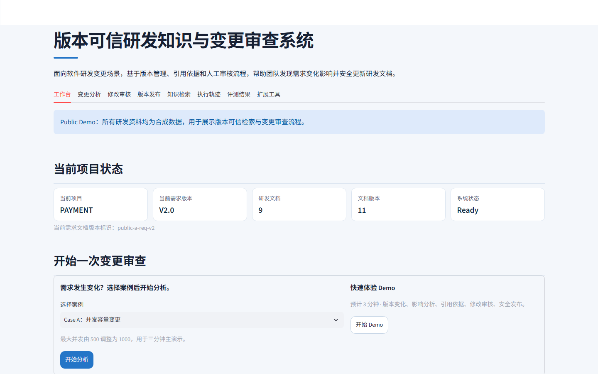

# 版本可信研发知识与变更审查系统

## 1. 项目定位

这是面向软件研发需求变更的版本可信知识与人工审查原型。研发需求从 V1 变为 V2 后，系统在当前有效文档范围内查找依据，区分已确认与疑似影响，提出可追溯的局部修改建议，并经过人工审核和确定性校验再发布候选版本。

公开演示只使用仓库内的合成文档与轻量索引。它不提供企业级权限隔离，也不承诺生成结果天然正确。

## 2. 为什么存在这个项目

研发需求、设计、接口和测试文档会持续迭代。普通 RAG 容易把新旧版本一起召回；普通生成式 Agent 又可能在缺少引用、未经审核或目标内容已经变化时直接写入。本项目把版本治理、Evidence、局部修改、人工审核、候选版本校验和安全发布放在一条可验证的业务链中。

## 3. 核心业务场景

- Case A（PAYMENT）：最大并发由 500 调整为 1000，涉及吞吐量和同步转异步的研发资料变更。
- Case B（AUDIT）：审计日志在线保存周期由 7 天调整为 30 天，用另一套 Requirement、Evidence、Patch 和研发资产验证同一流程。
- 系统区分 ACTIVE 与 SUPERSEDED 版本；默认检索当前有效资料，历史版本须显式指定。
- 影响分析分开呈现已登记关系和语义检索建议，后者始终需要人工判断。
- Agent 提议局部段落修改；审核、引用时效、冲突和候选版本校验通过后才安全发布。

两套固定合成案例证明同一业务链可复用，不代表对所有企业文档自动适用。

## 4. Public Demo

- [在线工作台](https://enterprise-rag-agent-suite-bfmkgsimdisxcewgco7ydk.streamlit.app/)
- [RAG API 文档](https://version-aware-rag-public-demo.onrender.com/docs)
- [RAG 健康状态](https://version-aware-rag-public-demo.onrender.com/health)

所有演示资料均为合成数据。Session 中的审核和候选版本操作使用临时存储，不会覆盖公开基线；免费服务空闲后可能冷启动。在线地址可能晚于仓库最新提交部署，演示前请检查页面导航与服务状态。公网配置见 [部署指南](project_delivery/public_value_prototype/free_deployment_guide.md)。

## 5. Why This Is More Than a Scripted Demo

- 两套独立合成变更案例使用不同变化类型、Requirement、Evidence、Patch 和资产组合。
- 核心 Domain、Retriever 与 Agent 没有 Case-specific business branching。
- 默认检索当前有效版本，历史版本必须显式查询，Evidence 保留版本和章节来源。
- Patch 必须经过 Human Review、Conflict Detection、Idempotency 和 Candidate Validation。
- 两套案例由相同 HTTP 工作流自动评测，并分别报告结果。
- Public profile 提供远程 RAG URL、只读 Baseline、Session 隔离、冷启动处理和 LLM 调用预算。

证据见 [硬编码审计](project_delivery/public_value_prototype/hardcode_audit.md) 与 [跨案例评测](project_delivery/public_value_prototype/cross_case_evaluation_report.md)。

## 6. 系统架构

```text
Streamlit 工作台
  工作台 → 变更分析 → 修改审核 → 版本发布
  知识检索 / 执行轨迹 / 评测结果 / 扩展工具
        │                          │
        │ HTTP 查询与版本目录       │ 变更审查操作
        ▼                          ▼
Version-aware RAG FastAPI ←HTTP→ Change Review Agent
DENSE_ONLY + SECTION_PATH          Impact / Evidence / Local Patch
ACTIVE / SUPERSEDED                Human Review / Quality Gate / Resume
Evidence / Citation / Diff         Candidate / Safe Activation
        │
        ▼
公开合成文档与经过校验的轻量检索资产
```

RAG 负责文档、版本和证据边界；Agent 通过 HTTP 使用 RAG，并管理影响分析、修改审核与发布门禁；UI 只展示现有服务与任务状态。当前正式实现没有 LangGraph、Hybrid、GraphRAG、数据库、Redis、消息队列或多 Agent。

## 7. RAG 与 Agent 职责边界

| 模块 | 负责 | 不负责 |
|---|---|---|
| Version-aware RAG | 文档结构处理、版本治理、Scope 检索、Evidence、Citation、Version Diff、候选版本构建与激活 | 审核决策、自动修改代码、证明答案一定正确 |
| Change Review Agent | 变化识别、已确认/疑似影响分层、Evidence Selection、局部修改、人工审核、Quality Gate、冲突与幂等、Checkpoint/Resume | 重新实现 Retriever、绕过版本边界、未经批准写入 |
| Streamlit UI | 用业务语言展示现有服务状态、Trace 和固定评测 | 绕过服务端门禁或用静态结果伪装执行 |

## 8. 三分钟 Demo 流程

1. 打开“工作台”，确认系统状态为 Ready，选择 Case A（并发 500 → 1000）或 Case B（日志 7 → 30 天）。
2. 点击“开始分析”或“开始 Demo”，进入“变更分析”，再点击“运行变更分析”。
3. 查看需求差异、已确认/疑似影响，以及文档、版本、章节和页码可追溯的引用依据。
4. 到“修改审核”并排比较修改前、建议修改和关联依据；填写审核人及意见后批准、编辑或驳回。
5. 到“版本发布”应用已批准修改，查看 Quality Gate、候选版本校验结果并安全发布。
6. 可选：到“知识检索”演示当前/历史版本范围与原始证据；“执行轨迹”和“评测结果”用于解释过程。公开资料默认禁用需要在线模型的 /query，主流程不依赖个人 API Key。

按钮触发真实的现有工作流，不会自动跳过人工审核，也不会用静态结果伪装发布。详细操作见 [首次使用流程](project_delivery/ui_product_experience/demo_user_flow.md)。

## 9. 核心工程设计

- 版本治理：同一文档只有一个当前有效版本，历史版本仅在显式 Scope 中可查询。
- Evidence Context Budget：候选先经过 Scope、版本、Freshness 和去重，再按 max_evidence_count 入选；关键 Evidence 超出预算时失败关闭，不静默丢弃。
- Deterministic Quality Gate：复用已有状态，统一输出 PASS 或 BLOCKED 及原因码，不增加 LLM Judge。
- 局部 Patch：只替换已经绑定 Anchor 与原文哈希的目标段落，不重写全文。
- Conflict Detection：基础版本、Anchor、原文或哈希变化都会阻止覆盖。
- Idempotency：Patch、基础版本、Anchor 和原文哈希共同形成幂等键。
- Candidate Version：写入候选文件并完成校验后才激活，原 DOCX 不被覆盖。
- Checkpoint/Resume：恢复时复用成功状态和已应用幂等键，避免重复副作用。
- HTTP 边界：Agent 通过现有 RAG API 工作，不导入 RAG 内部索引实现。

## 10. Evaluation

最新固定合成评测：

| 指标 | 结果 |
|---|---:|
| Evaluation Case Count | 7 |
| Hit@5 / Recall@5 / MRR | 1.0 / 1.0 / 1.0 |
| 当前版本正确性 | PASS |
| Citation membership | PASS |
| No-answer / Scope 拦截 | PASS |
| Retrieval P50 | 64.330 ms |
| Retrieval P95 | 68.384 ms |
| Impact Precision / Recall | 1.0 / 1.0 |
| 未批准写入 | 0 |
| 重复 Patch 应用 | 0 |
| Candidate Status | ACTIVE |

离线对照真实返回了 requirements-v1 与 requirements-v2；相同问题在正式 Version-aware Retrieval 中只返回 requirements-v2。该对照只存在于 Evaluation，不进入生产检索路径。结果文件位于 [evaluation_results.json](project_delivery/v4_change_impact_review/evaluation_results.json)。


### Cross-case Evaluation

| 检查 | Case A | Case B |
| --- | --- | --- |
| Change → Impact → Evidence → Patch → Review | PASS | PASS |
| Conflict / Idempotency | PASS | PASS |
| Candidate / Safe Activation / New Retrieval | PASS | PASS |
| Baseline Immutable | PASS | PASS |

Case A 与 Case B 结果分开记录在 [跨案例评测报告](project_delivery/public_value_prototype/cross_case_evaluation_report.md)。这不是“系统准确率 100%”。


## 11. 当前界面截图



截图取自本分支的本地 `public_demo` 配置，显示业务说明、所选项目的当前需求版本、目录统计和“开始分析”入口；不包含个人密钥或真实企业资料。实际在线界面以部署到 Streamlit Cloud 的提交为准。

## 12. Quick Start：新克隆仓库

Windows PowerShell、Python 3.12 和联网安装依赖；以下命令只使用仓库内已跟踪的合成资产。先在仓库根目录执行一次：

```powershell
py -3.12 -m venv RAG-Challenge-2-main\.venv
& .\RAG-Challenge-2-main\.venv\Scripts\python.exe -m pip install -r RAG-Challenge-2-main\requirements-render.txt
py -3.12 -m venv OpenManus-rag\.venv
& .\OpenManus-rag\.venv\Scripts\python.exe -m pip install -r OpenManus-rag\requirements.txt
& .\OpenManus-rag\.venv\Scripts\python.exe -m pip install -r demo-ui\requirements.txt
.\start_prototype.ps1
```

打开 http://127.0.0.1:8502；本地 RAG API 文档在 http://127.0.0.1:8765/docs。端口被占用时先停止旧服务，或使用 `.\start_prototype.ps1 -RagPort 18765 -UiPort 18502`。脚本固定加载 `RAG-Challenge-2-main/public_demo_artifacts/rd-v2-public-demo-v1`，并把 Session 运行结果写到系统临时目录；无需本机私有语料、旧 runtime 或真实 Secret。手动启动见 [UI README](demo-ui/README.md)。

## 13. Test / Validation

运行测试前，为 RAG 的轻量运行环境单独安装 pytest（公开 Demo 启动本身不需要它）；然后在仓库根目录分别运行：

```powershell
& .\RAG-Challenge-2-main\.venv\Scripts\python.exe -m pip install "pytest>=8,<9"
Push-Location RAG-Challenge-2-main
& .\.venv\Scripts\python.exe -m pytest tests -q
Pop-Location
Push-Location OpenManus-rag
& .\.venv\Scripts\python.exe -m pytest tests -q
Pop-Location
Push-Location demo-ui
& ..\OpenManus-rag\.venv\Scripts\python.exe -m pytest -p no:cacheprovider tests -q
Pop-Location
```

公开 RAG 的只读 Smoke：

```powershell
Push-Location RAG-Challenge-2-main
& .\.venv\Scripts\python.exe scripts\public_demo_smoke.py --base-url http://127.0.0.1:8765
Pop-Location
```

离线固定评测、跨案例验证和历史性能数字属于版本化工程证据；请勿把本地检索时延解释为公网端到端时延。当前 UI 优化的验证见 [变更报告](project_delivery/ui_product_experience/ui_change_report.md)。

## 14. Design Decisions

- 保留 DENSE_ONLY + SECTION_PATH，因为现有评测已经满足业务目标，本轮没有证据支持引入 Hybrid、BM25、RRF 或 Reranker。
- 不迁移 LangGraph，因为当前工作流状态机、Checkpoint 和副作用边界已清楚可测；迁移会增加风险而不增加本轮业务价值。
- 不做全文生成。局部修改更容易审核、冲突检查、幂等重放和保留原格式。
- Suggested Impact 始终是审核建议，不升级为确定事实。
- Token/Cost 本轮不展示。当前主链 llm_calls 为 0，且没有可靠 Usage 与可维护价格配置。
- UI 不伪造工作流结果或自行判定门禁；状态查询与用户操作走现有服务。

## 15. Known Limitations

1. Scope 是业务检索范围，不等于 ACL/RBAC。
2. Evidence/Citation 提供可追溯性，不自动证明答案事实正确。
3. Suggested Impact 不等于 Confirmed Trace。
4. Human Review 当前是单审核人 MVP。
5. Demo 主要使用合成研发资料。
6. 主要 Engineering Asset 为 DOCX。
7. Patch 只覆盖正式支持的有限段落替换操作。
8. Vector Backend 继续使用 FAISS。
9. 当前不实现多租户。
10. 当前不实现自动代码修改。
11. 当前不替代完整 ALM / SDLC 工具。

## 16. Roadmap

后续如果有真实需求，可以在保持 HTTP 边界、Evidence、Quality Gate 和候选版本机制的前提下扩展 Git Diff 作为新的 Engineering Asset Adapter。它不会改变当前版本可信 RAG 与人工审查主链。当前公开版本不实施该能力。

## Repository Layout

- [RAG-Challenge-2-main](RAG-Challenge-2-main/)：版本可信研发知识服务。
- [OpenManus-rag](OpenManus-rag/)：Evidence-driven 变更审查 Agent。
- [demo-ui](demo-ui/)：统一 Streamlit 产品入口。
- [project_delivery/prototype_final](project_delivery/prototype_final/)：差距分析、架构、Demo、评测、回归和面试材料。
- [project_delivery/public_value_prototype](project_delivery/public_value_prototype/)：跨案例价值验证、公开部署与安全资料。
- [project_delivery/ui_product_experience](project_delivery/ui_product_experience/)：工作台信息架构、首次使用流程与界面截图。

仓库不包含个人 API Key、真实企业研发资料或用户本地运行输出。两个子项目保留原始许可证与著作权声明。
