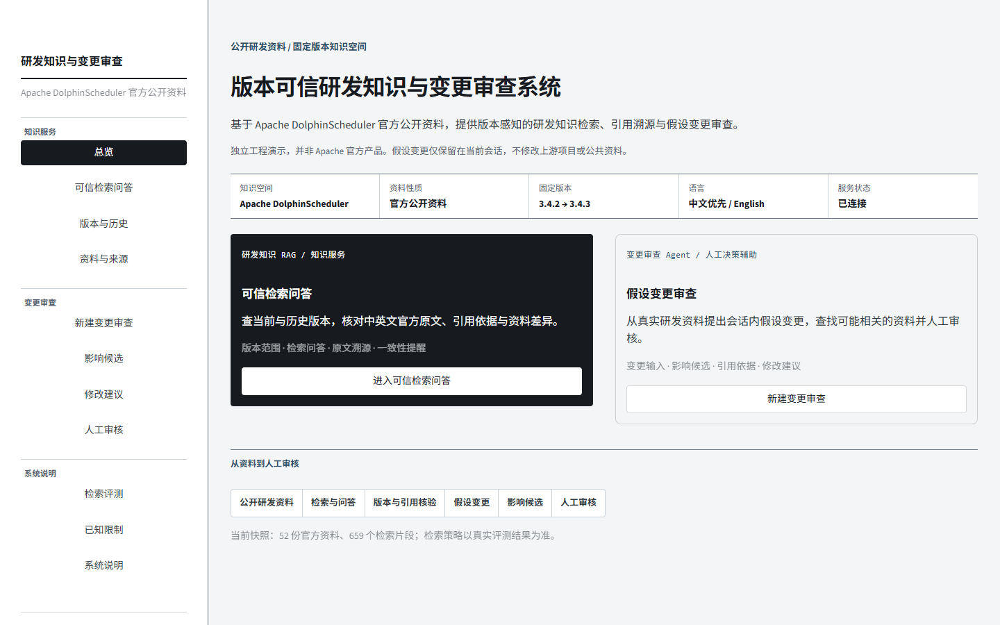

# 研发知识版本服务与变更影响审查系统

基于 Apache DolphinScheduler 官方公开资料构建的版本化研发知识服务与变更影响审查系统。RAG 按版本检索资料并提供可追溯依据；Agent 调用检索结果整理影响候选和修改建议，由人审核。本项目是独立工程演示，不是 Apache 官方产品，也不代表上游内部系统。

- [GitHub 源码仓库](https://github.com/Wdp-SE/enterprise-rag-agent-suite)
- [在线工作台](https://enterprise-rag-agent-suite-bfmkgsimdisxcewgco7ydk.streamlit.app/)
- [RAG API 文档](https://version-aware-rag-public-demo.onrender.com/docs)
- [RAG 健康状态](https://version-aware-rag-public-demo.onrender.com/health)
- [最终检索选型报告](evaluation/real_world_retrieval/final_selection/final_selection.md)

> 在线链接指向已有公网服务，实际运行版本以托管平台显示的部署提交为准。



## 项目与架构

研发人员可以在固定版本的 DolphinScheduler 资料中提问，查看命中的章节、原文和来源；也可以用自然语言提出假设性变更，由 Agent 拆分检索问题、调用 RAG、展示检索轨迹和证据缺口，再整理影响候选与修改建议。选定片段的修改前后对照是可选步骤，最终由用户人工审核。Agent 的草案保存在当前 Session 沙箱中，不修改公共语料或 Apache 上游；人工决定可下载为会话审查记录，但不是持久化审批审计。

    Apache DolphinScheduler 官方资料快照
      → 固定版本、来源、语言和章节元数据
      → FastAPI：BM25 检索、候选证据及可选的带引用生成
      → Streamlit：研发知识服务与变更审查 Agent
      → 人工核对与审核

在线工作台用于体验产品流程；API 文档用于查看公开 RAG 接口。当前公开语料是 Apache DolphinScheduler 3.4.2 与 3.4.3 的固定提交快照，共 132 份来源、1322 个检索片段；默认版本由语料清单的 `current_version` 指向 3.4.3，并不实时追踪上游发布。启动时不抓取上游，也不重建索引。扩充后的 V3 冻结评测在 DEV 上比较候选后锁定 BM25，并对它运行一次 HOLDOUT；运行默认策略保留 BM25。旧语料上的选型成绩不能当成新语料成绩。

### 目录职责

- `versioned-rag-service/`：FastAPI 知识服务，负责版本范围内的 BM25 检索、引用依据和可选的引用约束回答。
- `change-review-agent/`：变更审查 Agent 与可复用的证据约束工作流，负责组织影响候选、修改建议和人工审核状态。
- `demo-ui/`：Streamlit 工作台，连接 RAG 服务并呈现检索和审查流程。

## 检索选型：历史基线与当前复评

以下是历史 V1 选型记录：在当时同一份 52 来源语料、同一版本过滤和语言范围、Chunk A、Top-5 条件下，比较了 BM25、真实多语言神经 Dense（multilingual E5）和 Hybrid。以下 Hit@K、MRR 均按 DEV 的 22 条可回答问题计算；耗时是本地进程内 warm retrieval，不含模型加载、HTTP、冷启动或生成。

| 方案 | DEV Hit@1 | DEV Hit@5 | DEV MRR | 双来源完整命中 | P95 |
| --- | ---: | ---: | ---: | ---: | ---: |
| BM25 | 0.3636 | 0.8182 | 0.5295 | 0/2 | 1.36 ms |
| multilingual E5 | 0.2727 | 0.7273 | 0.4508 | 0/2 | 21.94 ms |
| Hybrid，BM25 权重 0.75 | 0.3636 | 0.8182 | 0.5470 | 0/2 | 22.31 ms |
| 锁定的 BM25 HOLDOUT | 0.4286 | 0.7619 | 0.5833 | 0/2 | 1.55 ms |

Hybrid 的最佳配置只让 DEV MRR 小幅增加 0.0175；Hit@1、Hit@5 和跨文档双来源命中均未改善，P95 则显著高于 BM25。因此 V1.0 保留 Chunk A（1250 chars、无 overlap）+ BM25 + Top-5，不设置文档数上限；Hybrid、神经 Dense 和 Rerank 不进入正式检索链路。跨文档题合计双来源完整命中为 0/4。HOLDOUT 是从此前已评测的 46 条题目中做的回顾性确定划分，不是独立真实用户测试，不能据此声称真实用户准确率。

工作台评测页优先展示与当前语料和检索实现指纹匹配的 V3 成绩；下方早期字符哈希 Dense 对照明确标为历史实验，不代表 multilingual E5 选型结果。历史选型的方法、切分和失败分析见[最终选型报告](evaluation/real_world_retrieval/final_selection/final_selection.md)。

### V2 检索质量实验

随后在旧版 52 份来源、659 个 chunk 上用独立 40 条查询做了 V2 来源级 DEV/HOLDOUT 对比。字段加权 BM25 候选在 DEV 上表现更好，但未通过锁定 HOLDOUT 晋级门槛，因此没有切换默认策略。这是扩充语料之前的历史实验，不能代表当前 132 份来源的质量。指标定义、历史结果和扩充后的回归诊断见[V2 实验报告](evaluation/real_world_retrieval/quality_v2/report.md)。

### V3 扩充语料评测

面向当前 132 份来源、1322 个片段，V3 新建并冻结了 72 道业务题，按场景家族分为 DEV/HOLDOUT 各 36 道，避免同一场景家族跨组。DEV 比较 BM25 与三种来源多样化候选：候选多找到一题的必需来源，却挤掉了部分含关键原文的片段，因此在打开 HOLDOUT 前锁定 BM25。BM25 在一次性 HOLDOUT 的 32 道可回答题中，27 道找齐全部必需来源；8 道多来源题只有 4 道找齐，返回片段找到 37/49 个原文证据锚点。该结果验证了当前运行策略的离线检索表现，也暴露跨资料、跨版本核对短板；它不是答案准确率、幻觉率或公网性能证明。题库、锁文件、结果与失败题见 [V3 评测说明](evaluation/real_world_retrieval/quality_v3/README.md)和 [V3 报告](evaluation/real_world_retrieval/quality_v3/report.md)。

原文配图另有[固定版本图片证据清单](versioned-rag-service/public_corpus/FIGURE_EVIDENCE.md)：132 份来源里扫描到 307 张按提交固定的图片，仅 6 张完成实际下载与完整解码校验；其中 5 张提取到尚未人工校对的 OCR 候选文字。图片文字尚未进入正式检索索引，不能把 Markdown 的 alt 文本或文件名当作图像识别结果。下一步须人工校对并为图片问题建立独立评测，才能决定是否索引。

在仓库根目录可用只读测试核对 V3 冻结输入、已保存的 DEV 结果哈希与一次性 HOLDOUT 记录；这不是完整线上性能测试：

```powershell
python -m unittest discover -s evaluation/real_world_retrieval/quality_v3 -p test_quality_v3.py
```

不要在当前冻结目录重跑 `run_quality_v3.py --split dev`：它会覆盖 `results/dev__bm25.json`，新测得的耗时会改变已锁定的结果哈希。需要重新实验时，应使用独立工作树或新评测版本，并把结果写到独立路径，保留这份冻结记录不变。

### Final selection 的复现边界

`run_selection.py` 提供 `chunk` → `retriever` → `topk` → `diversity` → `holdout` 阶段，没有单条命令完整重跑 final selection。Holdout 受 `selection_lock.json` 及其锁定的 DEV 结果哈希约束；当前冻结结果已包含 Holdout，不能对它随意重复执行。下面只示范 DEV 分块策略阶段，不代表完整选型重跑；该命令会更新 `evaluation/real_world_retrieval/final_selection/results.json`：

```powershell
python .\evaluation\real_world_retrieval\final_selection\run_selection.py chunk --chunk A
```

## 三分钟体验

1. 打开在线工作台的“可信检索问答”，询问 DolphinScheduler 的参数优先级；核对答案引用或检索候选及原文来源。
2. 进入“新建变更审查”，用自然语言描述假设性研发变更；Agent 先检索当前版本官方资料，再整理带证据 ID 和原因的影响候选。
3. 查看检索轨迹、证据缺口、建议核对动作及可选的段落前后对照，再由人审核；可下载包含任务编号、证据 ID 和决定的本次会话记录。流程不修改公共语料或上游仓库。

## Known Limitations

- 132 份语料仍是官方资料的有限子集，不覆盖 DolphinScheduler 全部功能和历史；原文图片中的文字尚未纳入检索。
- 历史 V1 四条跨文档题的双来源完整 Top-5 命中为 0/4。扩充语料会改变排序，现有新语料成绩必须单独复评，不能沿用历史指标。
- V1 HOLDOUT 来自此前使用过的题集，是回顾性确定划分；V2 是旧语料的独立锁定题集；V3 是当前语料的新冻结题集，但题目及标注在仓库可见，都不能等同于真实用户开放测试。
- Agent 的草案与审核状态只存在当前 Session 沙箱中；下载的 JSON 可人工留档，但系统没有持久化身份、审批审计或跨会话工作区。
- 系统不修改 Apache 上游，不创建 PR，也不自动发布修改。
- multilingual E5 仅用于选型实验；Hybrid 和 Rerank 均不在正式运行链路中。
- 资料命中和引用来源不等于回答事实已被证明；检索分数只用于排序，不代表真实性。
- 当前版本不实现 locale sibling consistency；语言/版本相关提示不能替代人工核对。
- 本地 P95 不代表公网延迟或服务等级承诺。
- 公开 RAG API 当前没有访问身份鉴权；若在公网后端配置付费模型密钥，直接调用公开生成接口也会产生费用。系统不设会话调用次数上限，部署者需在模型服务商侧设置预算与费用告警，并监控请求量；这不是企业级成本治理或用户级计费审计。

## 本地启动

本地 clean-clone 已在 Python 3.11 验证通过；这记录的是已验证环境，不代表项目最低 Python 版本。Render 部署配置使用 Python 3.12.8；本文不推测 Streamlit Community Cloud 的 Python 版本。克隆后无需私有企业资料或本机历史 runtime：

    py -3.11 -m venv versioned-rag-service\.venv
    & .\versioned-rag-service\.venv\Scripts\python.exe -m pip install -r versioned-rag-service\requirements-render.txt
    py -3.11 -m venv change-review-agent\.venv
    & .\change-review-agent\.venv\Scripts\python.exe -m pip install -r change-review-agent\requirements.txt
    & .\change-review-agent\.venv\Scripts\python.exe -m pip install -r demo-ui\requirements.txt
    .\start_prototype.ps1

打开 http://127.0.0.1:8502/；本地 RAG API 文档为 http://127.0.0.1:8765/docs。无模型密钥时仍可检索和进行会话内变更审查。默认生成服务为 DashScope/Qwen（`DASHSCOPE_API_KEY`）；也支持 DeepSeek（`RD_V2_GENERATION_PROVIDER=deepseek`、`RD_V2_GENERATION_MODEL=deepseek-v4-flash`、`DEEPSEEK_API_KEY`）。仅在本机 RAG 后端或 Render RAG 后端配置密钥，不要写入仓库、日志或 Streamlit Secrets。详细字段见[部署指南](project_delivery/public_value_prototype/free_deployment_guide.md)和[工作台说明](demo-ui/README.md)。

应用不设固定会话生成次数上限。后端生成开关、模型密钥和供应商服务状态共同决定能否生成；供应商的计费余额、限流和网络超时仍可能导致单次失败。失败时保留可核查的检索证据，不能承诺“只要有余额每次必定成功”。`/health` 可区分关闭生成、缺密钥与已配置但未经实时验证；成功或失败请求返回不含密钥的生成诊断，便于定位问题。原文配图可指向固定来源，**图中文字目前未纳入正式索引与检索**。

## 资料来源

语料来自 [Apache DolphinScheduler](https://github.com/apache/dolphinscheduler) 官方固定版本资料、Release、DSIP Issue 和明确关联的 PR。来源 URL、tag 对应 commit、路径、语言、许可证与 SHA-256 见 [corpus_manifest.json](versioned-rag-service/public_corpus/corpus_manifest.json)。Apache License 与 NOTICE 随快照保留；本项目与 Apache 基金会无隶属关系。
