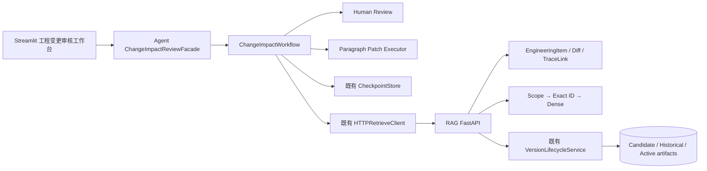
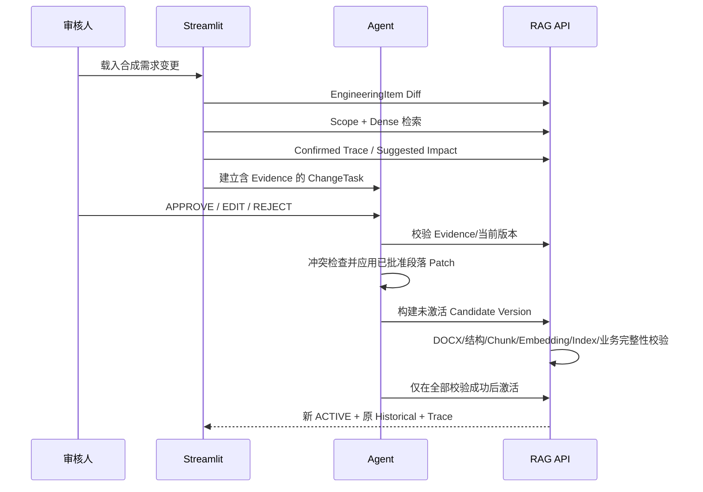

# V4 架构说明

## 目标

V4 在 V3 Stable 上增加“研发文档变更影响分析与人工审核闭环”。它保持三个既有边界：RAG 负责资料、版本、检索和引用；Agent 负责任务、审核、Patch 与候选版编排；Streamlit 只展示状态并调用公开接口。`organization_id` 是业务归属字段，不代表已经实现多租户隔离或权限系统。

## 组件关系

## 端到端数据流

## 代码落点

- RAG 通用增量：`RAG-Challenge-2-main/src/engineering_change/`
- RAG HTTP 边界：`RAG-Challenge-2-main/src/rd_v2_api.py`
- Agent 增量：`OpenManus-rag/app/change_impact_review/`
- 复用 HTTP 客户端：`OpenManus-rag/app/document_workflow/rag.py`
- UI 展示：`demo-ui/components/change_impact_view.py`
- UI 编排适配：`demo-ui/services/change_impact_client.py`
- 合成资料：`project_delivery/v4_change_impact_review/demo_data/`

## 复用与未引入项

V4 复用了 VersionLifecycleService、Scope、Dense 检索、Evidence、Freshness、Checkpoint、单审核人模型、DOCX 能力、FastAPI 和 Streamlit。没有引入 LangGraph，因为现有流程仍能清楚表达分支、恢复和门禁；没有上线 BM25/Hybrid，因为固定评测未证明其相对 Dense 基线存在必要净收益。也没有新增数据库、React、Connector、权限系统或第二套公司流程。
