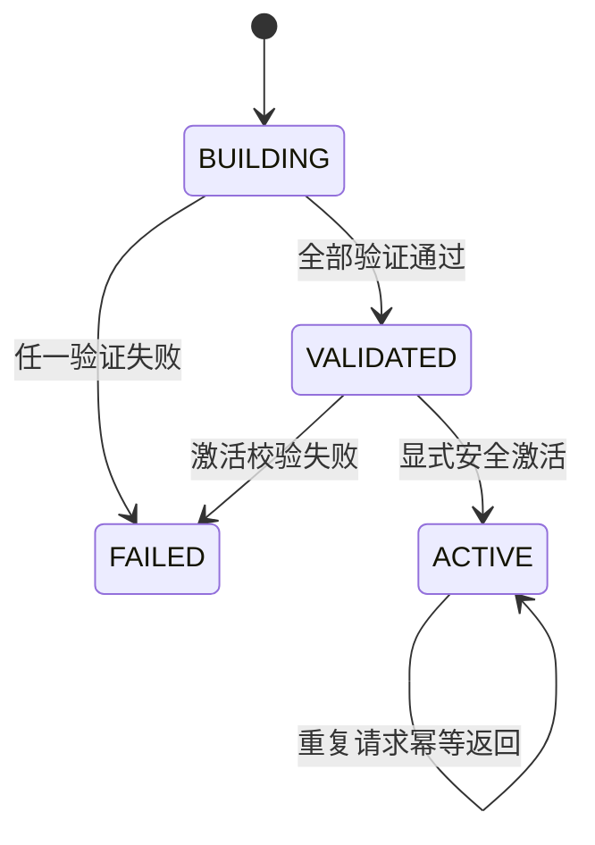

# V4 领域模型

## 稳定核心

| 模型 | 所属 | 作用 |
|---|---|---|
| Document / DocumentVersion / Section | RAG | 文档身份、版本状态、结构和历史 |
| EngineeringItem | RAG | 统一表达需求、设计、API、测试、运维业务项 |
| TraceLink | RAG | 区分显式已确认关系与语义候选关系 |
| Evidence | RAG 产生、Agent 使用 | 保存来源、版本、Section、内容哈希与 Scope |
| ImpactCandidate | Agent | 把 RAG 发现转换为待审核的影响项 |
| PatchCandidate | Agent | 只描述一个目标段落的局部替换 |
| HumanReview | Agent | 记录单审核人的批准、编辑或拒绝 |
| CandidateVersion | RAG | 完整验证通过前保持非 ACTIVE 的候选版 |

## EngineeringItem

`EngineeringItem` 统一字段包括 item/type、organization/project/document/version/section、external_identifier、title、content、content_hash 和 metadata。首版没有拆成 Requirement、APIEndpoint 等大量子类，避免企业格式差异污染核心模型。

`item_type` 仅包含 `REQUIREMENT / DESIGN / API / TEST_CASE / RUNBOOK`。同一段落里出现的跨文档编号仍可被 IdentifierExtractor 识别，但演示库存只登记由当前文档类型拥有的主业务项；其余编号用于建立 Trace，不重复制造实体。

## TraceLink 与 ImpactCandidate

- `EXPLICIT + CONFIRMED`：来自明确编号或已确认结构关系，是已确认影响。
- `SEMANTIC + SUGGESTED`：来自 Dense 检索，只是待人工判断的疑似影响。
- Suggested 不会自动升级为 Confirmed。

ImpactCandidate 保留 changed/impacted item、discovery_source、evidence_ids、可选 trace_link_id 和 review_status，因此 UI 能直接区分事实关系与候选关系。

## PatchCandidate

首版只支持 `REPLACE_PARAGRAPH`，并保存 base_version、target_anchor、original_content/hash、proposed_content、reason、evidence_ids、scope_fingerprint、review_status 和幂等键。模型没有伪造未校准的 confidence/risk 分数。

## CandidateVersion 状态

失败不会先撤销旧 ACTIVE。新版本激活后，旧版本转为 SUPERSEDED 并仍可显式检索。
